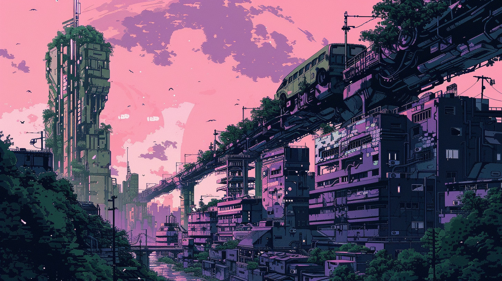
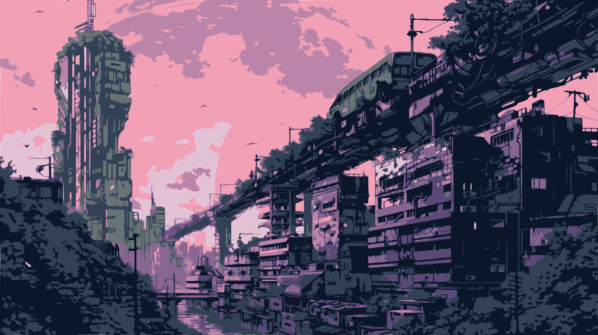
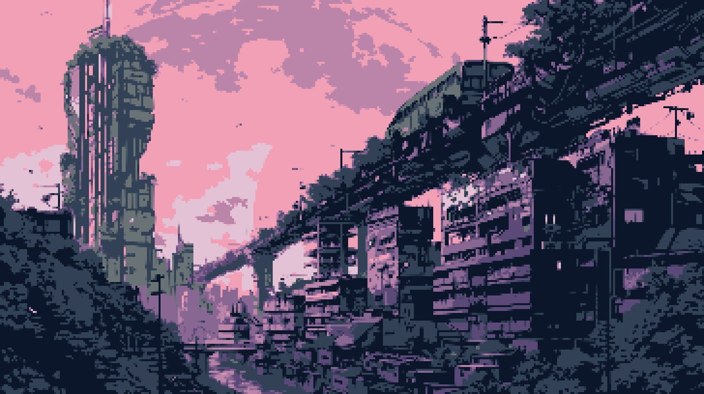
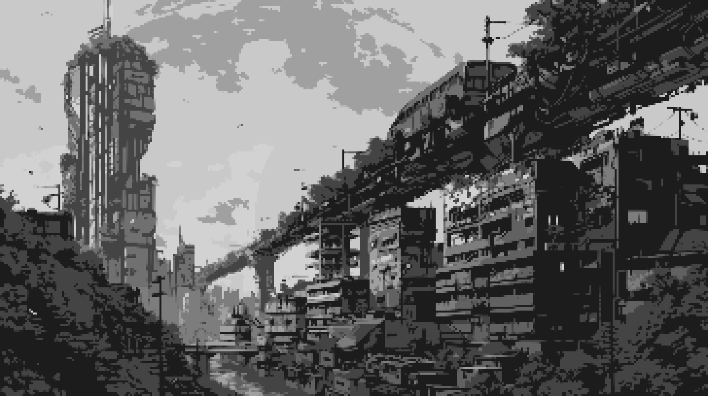
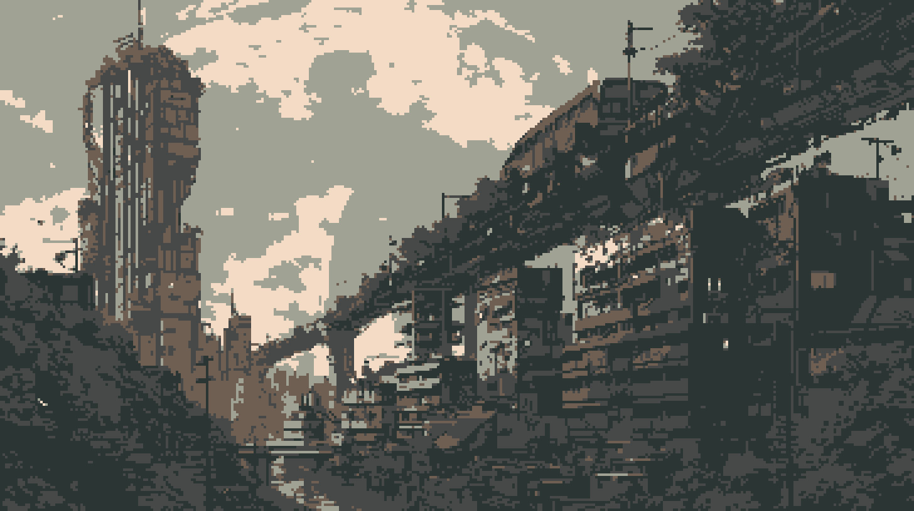

I recently started to code a small game with pygame, and I discovered it was a hassle to create mockup assets that don't make everyone who sees your prototype ask, "Is it the final graphics? Because it looks crappy".

## Midjourney etc. 

I started to look for solutions that could give me good results without wasting too much time. The first thing that came to my mind was of course, Midjourney or Stable Diffusion, but despite a lot of articles about "[How to Generate Pixel Art with Midjourney](https://aituts.com/midjourney-pixel-art/)" I found the results poorly convincing.

This is a result I've got with this basic prompt:

```
a cyberpunk city, brutalism, pixel art, ink drawing, minimalism --ar 16:9 --v 6.0
```



That's great, but that's not real pixel art, and I had trouble figuring out how to get close to the style I wanted for my game. In addition to having shapes that are not neat enough, all the pixel arts generated by AI have too many colors. Let's take the image above and try to improve it.

## Reduce the colors

I like to use Midjourney for this kind of thing. The generated arts aren't bad (especially for someone who isn't an advanced artist), and it's easy to quickly create a mood by reusing the same prompt elements. My first goal was to find a way to reduce the complexity of the image and the number of colors. After deeper researches, it appeared that the best way to achieve what I was looking to was to simplify images using vectorization. I found the perfect tool for that here: [vectorizer.io](https://www.vectorizer.io/).

After a little bit of time playing with all the parameters, I decided to update only two of them: `8 colors` for the input options and `30px² Minimum Area` for the output options. The result:



It's perfect! Way simpler and smoother than the original.

## Let's pixelate!

It didn't take long determining the next step. Based on the observation that pixel art is pixels, the best way to pixelate an image is to reduce its size, then re-enlarge it!

You can see below what I got by reducing the image scale four times and re-enlarging it to the original size. The key here is to prevent the tool you're using to rescale from applying antialiasing. We want to keep everything as rough as possible. Here I used Gimp, but you can use any image editor you want.

Resized from `1456 x 816` to `364 x 204`:


And back to `1456 x 816`:



The result is far from perfect, but finally the image looks like real pixel art. I guess the method can be improved by taking more time tweaking the parameters, but for mockups it will do the trick perfectly!

## Color palette

Now we have a pretty pixel art mockup, but there was one little thing left to work on. I chose to reduce the color in the picture to 8 for one reason: there is an 8 colors palette I really like, and I decided to use it in my game. Moreover, limiting the number of colors used in a palette will give reminiscent of retro games.

The first thing we need to do is to reduce the saturation. The method used to switch color palette is called indexing and it gives better result with grey scaled images. This allows rapid and efficient color changes without having to update every pixel in the image individually.



I also used Gimp for this step, here is an example using [Custodian 8](https://lospec.com/palette-list/custodian-8). The vibe is now more earthy and rusty, exactly what I wanted!



## In Conclusion

I guess I will continue to experiment with this method. Despite the challenges encountered, this iterative process ultimately produced satisfactory results that meet my needs. Generating it is straightforward, and it complements visual storytelling during the development phase.
