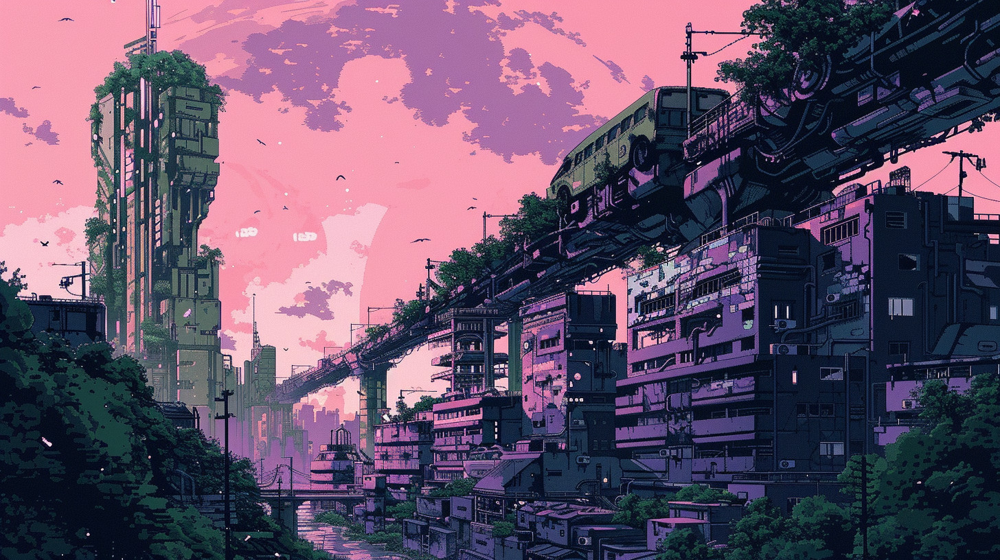
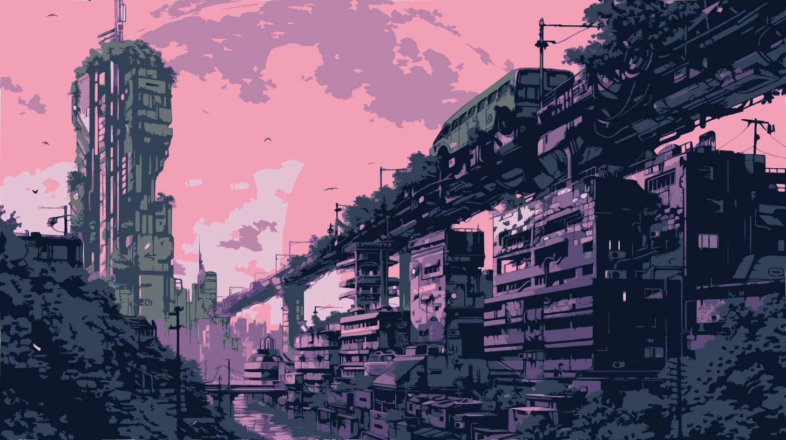
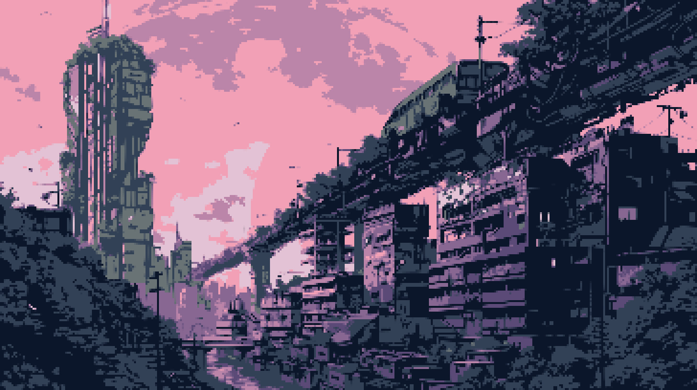
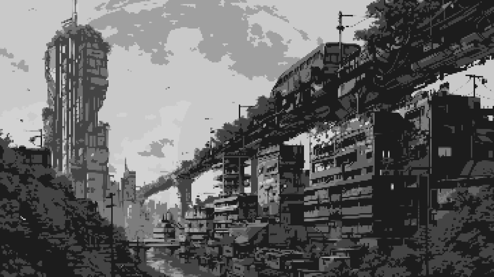
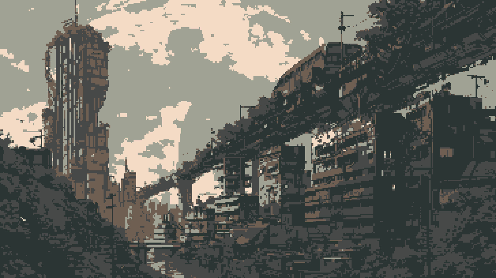

I recently started to code a small game with pygame, and I discovered it was a hassle to create mockup assets that don't make everyone who sees your prototype ask, "Is it the final graphics? Because it looks crappy".

## Midjourney etc. 

I started to look for solutions that could give me good results without wasting too much time. At least by the time I finish polishing the core engine and start writing the story. The first thing that comes to my mind is, of course, Midjourney and Stable Diffusion and despite articles about "[How to Generate Pixel Art with Midjourney](https://aituts.com/midjourney-pixel-art/)" I found the results poorly convincing.

This a result I've got with this basic prompt:

```
a cyberpunk city, brutalism, pixel art, ink drawing, minimalism --ar 16:9 --v 6.0
```



That's great, but that's not real pixel art, and I had trouble figuring out how to get close to the style I want for my game. In addition to having shapes that are not sufficiently defined, all the pixel arts generated by AI have too many colors. Let's take the image above and try improve it.

## Reduce the colors

I like to use Midjourney for this kind of thing. The generated arts aren't bad (especially for someone who isn't an advanced artist), and it's easy to quickly create a mood by reusing the same prompt elements. The first thing I thought was to find a way to reduce the complexity of the image and the number of colors. After some other research, it appears that the best way to do what I was looking for was to simplify images using vectorization. I found the perfect tool to do that here: [vectorizer.io](https://www.vectorizer.io/).

After a little bit of time playing with all the parameters, I decided to choose to update only two of them: `8 colors` for the input options and `30px² Minimum Area` for the output options. The result:



It's perfect! Way more simple and smooth than the original.

## Let's pixelate!

I didn't think long about choosing the next step. Based on the observation that pixel art is pixels, the best way to pixelate an image is to reduce its size, then re-enlarge it!

You can see below what I got by reducing the image scale by four and re-enlarging it to the original size. The key here is to prevent the tool you're using to rescale from applying antialiasing. We want to keep everything as sharp as possible. Here I used Gimp, but you can use any image editor you want.

Resized from `1456 x 816` to `364 x 204`:


And back to `1456 x 816`:



The result is far from perfect, but finally the image looks like real pixel art. I guess the method can be improved by taking more time tweaking the parameters, but for mockups it will do the trick perfectly!

## Color palette

Now we have a pretty pixel art mockup, but there was one little thing I wanted to. I chose to reduce the color to 8 for one reason: I wanted to use some color palettes I like that have only this exact number of colors within.

The first thing we need to do is to reduce the saturation. The method used to switch color palette is called indexing and it gives get better result with grey scaled image. This allows for rapid and efficient color changes without having to update every pixel in the image individually. 



I also used Gimp for this step, here is an example using [Custodian 8](https://lospec.com/palette-list/custodian-8). The vibe is now more earthy and rusty, exactly like I wanted!



## In Conclusion

I guess I will continue to experiment with this method. Despite the challenges encountered, this iterative process ultimately yielded satisfactory results conducive for my needs. Generating it is straightforward, and it complements visual storytelling during the development phase.
